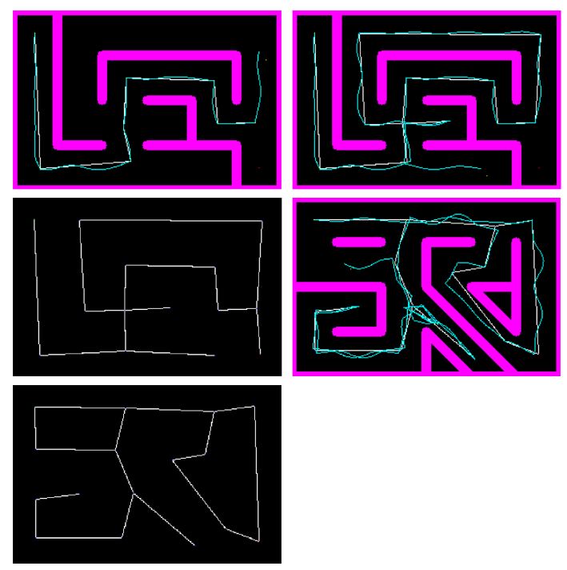
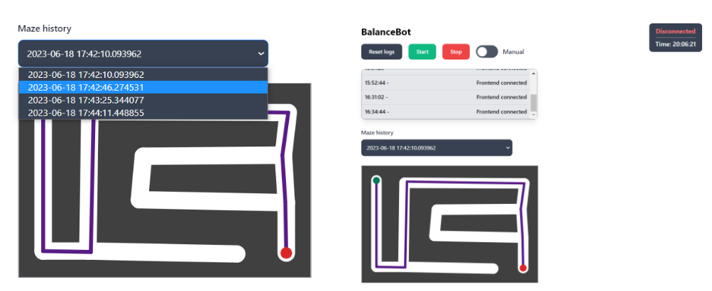

# BalanceBot

An autonomous balancing robot that is able to map and navigate a maze of light strips. A set of three beacons are also placed around the maze to aid with localisation.

- `esp32` contains the microcontroller code.
- `fpga` contains the code to put on the onboard FPGA, for e.g. image processing.
- `maze` contains the logic for localisation, tracking the state of the map, and issuing navigation commands.
- `power` contains the code for managing the power supplies for the electronics.
- `webserver` provides the server, written using FastAPI.

The overall system architecture:

The architecture of the mapping and navigation logic:

Some screenshots of the simulation program created to test the mapping and navigation logic:

(walls are shown in purple, the actual path of the robot is shown in blue, and the deduced 'clear path' through the maze is shown in white.)

The front-end, with ability to see past maps stored in the database:

